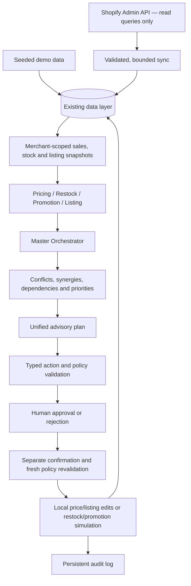

# CartPilot Architecture — Verified MVP

## Implemented stack and boundaries

React 18 + TypeScript + Vite frontend provides Dashboard, Products, Inventory,
AI Manager, Recommendations, Agent Activity, Approvals, Action History and Integrations.
FastAPI exposes typed APIs; SQLAlchemy async services read/write the existing models.
PostgreSQL is the deployment target, SQLite is used for isolated tests/offline demos.
Redis is optional infrastructure diagnostics; recommendations/execution do not depend
on Redis availability. Health explicitly reports configured disconnected components as degraded. An empty
REDIS_URL disables Redis diagnostics; database-only health can remain ok.

All four specialists and the orchestrator use deterministic Python rules and Decimal
money calculations. No LLM, LangGraph runtime, automatic learning or external execution
is implemented. Confidence/quality/priority scores are documented heuristics, not
calibrated predictions. Analysis cannot execute or implicitly flush pending changes.

Product, Inventory, Order, OrderItem and PriceHistory store analysis data. Existing
Recommendation, Action, Approval and AuditLog implement guarded local execution.
AgentRun exists in the data layer; the UI's Agent Activity is browser-session history,
not fabricated persistent agent runs. ShopifyConnection/ExternalProductMapping/
ExternalOrderMapping hold source identity, location snapshots and last-sync metadata;
no credentials or unnecessary customer payloads are retained.

## Security and consistency

The MVP validates merchant-product/recommendation/action ownership. Frontend analysis
calls always send merchant scope. Legacy single-product APIs permit omitted scope
for compatibility in anonymous development/test demos. Phase 15 binds authenticated
requests to the session merchant, including these legacy routes, and requires accounts
for production business APIs. General public readiness still requires rate controls
and broader security/load review. Action writes and Shopify routes are restricted
to development/test. Sessions use opaque revocable tokens; see the continuation below.

Approval and execution are separate. Atomic claims, PostgreSQL row locks, source-value
comparisons, immutable payload verification, current-state policy validation, savepoints,
unique workflow identity and audit events protect execution. SQLite enables foreign
keys in app/tests, but does not prove PostgreSQL locking behavior. All policies require
human approval. Simulated replenishment does not satisfy actual stock arrival.

Shopify is the external source; the local DB is an analysis/cache layer. The fixed
GraphQL query registry cannot dispatch arbitrary mutations or follow redirects.
Credentials come only from backend environment settings. Agents never call Shopify.
Sync is manual and bounded, uses idempotent mappings and independent commits, and
reports partial failures. Missing cost/stock blocks dependent unsafe recommendations.
Local actions are explicitly not synchronized to Shopify.

No SQL bind values, raw infrastructure exceptions or upstream Shopify payloads are
logged. API failures return sanitized 503/500 responses. CORS defaults to explicit
local frontend origins; wildcard production origins are rejected. Secrets, local DB
files and generated dependencies/builds are excluded from Git and Docker contexts.

Timestamps are UTC: PostgreSQL retains timezone-aware columns, while SQLite returns
naive UTC values. Public product/inventory/history/action timestamp schemas normalize
those SQLite values to UTC. Browser presentation uses the browser's local timezone.
Money uses Decimal and two-decimal Numeric(10,2); frontend formatting is presentation
only, with no FX conversion. Shopify approximate discounted units round explicitly.

## Limits and performance

Catalog pages max out at 100 products; saved recommendations at 200. Intelligent
store analysis uses at most 100 active products and exposes truncation, failures and
omitted queue items. MAX_ACTIONS_PER_PLAN bounds priority candidates; unsafe work
stays visibly blocked. Shared lookbacks reuse snapshots. Catalog reuses preloaded
products/inventory/history, but sales aggregates still scale linearly with products.

See [Phase 12 matrix and evidence](phases/PHASE_12.md) for regression, failure injection,
clean bootstrap, browser walkthrough, performance and unverified deployment limits.

## Deployment boundary (Phase 13)

Browser → HTTPS static frontend → HTTPS Python/FastAPI service → managed PostgreSQL.
Optional Redis provides diagnostics; backend-only Shopify read access is available
only in a protected private demo under the existing development/test gate. Production
mode keeps guarded writes and Shopify routes blocked. Phase 15 adds required account
authentication for production business APIs.
Backend validates environment, database URL, port and log level centrally; serving,
release migrations and explicit demo seeding are separate operations. Frontend API
URL is a public build-time setting; static host routing falls back to index.html.
See [DEPLOYMENT.md](DEPLOYMENT.md) for configuration and actual verification limits.

## Sense → Decide → Act → Learn (final academic description)

**Sense:** demo/Shopify read-only data, scoped product/order/inventory/history reads and
shared sales/coverage/listing signals. **Decide:** four deterministic specialists and
Master Orchestrator relationship/priority rules. **Act:** policies, human review, separate
confirmation and fresh guarded local mutation or simulated operations. **Learn:** audit
and outcomes are recorded for human review; there is no autonomous retraining, adaptive
model update or reinforcement learning. The feedback arrow represents updated local
data for subsequent analysis, not a trained learning loop.

[Algorithms](docs/ALGORITHMS.md), [API/entities/security](docs/API_DATABASE_SECURITY.md),
[final status](FINAL_STATUS.md) and [test evidence](TEST_SUMMARY.md) are the submission
references. Confidence scores are heuristic; no measured business uplift is claimed.

## User-authorized account/store continuation

The new account boundary uses scrypt password hashes and hashed, revocable opaque
sessions. Production business routers require authentication and compare caller scope
to the session's merchant; merchants are filtered to the account's store. New management
APIs always require an account. Product archive preserves history, manual prices create
PriceHistory, sales reference import is bounded/idempotent and creates scoped orders.
These additions do not enable external agent execution or production guarded action writes.
See docs/ACCOUNT_STORE_MANAGEMENT.md for remaining identity and notification limitations.
