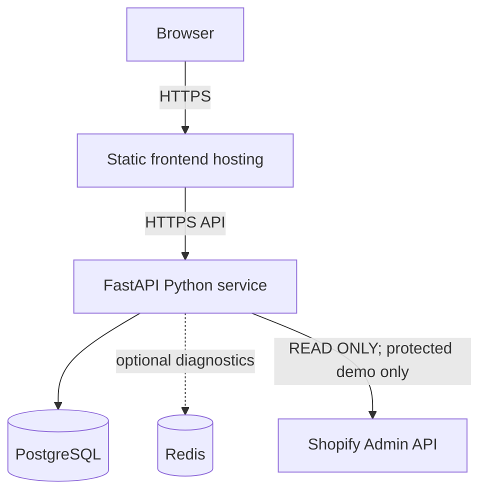

# CartPilot deployment

This setup is provider-neutral: static frontend hosting, one Python service, managed
PostgreSQL, and optionally Redis. No cloud account, public URL or live Shopify store
has been configured. The application is deployable for a protected demo; it has no
production authentication and must not be exposed as a public multi-tenant service.



## Runtime and access modes

- `ENVIRONMENT=production`: advisory API runtime; local action creation, approval,
  execution and all Shopify integration routes return 403. This preserves existing
  safety gates. Reading data still requires a protected network/hosting boundary.
- `ENVIRONMENT=development`: trusted private faculty demo using the production
  start command and static frontend build. Existing approval, execution confirmation,
  policy validation, merchant scope and audit controls remain mandatory. Restrict
  access with the hosting provider's access controls or a private network **before**
  enabling this mode. It is not a substitute for production authentication.
- `ENVIRONMENT=test`: isolated tests/offline mocked demo, not a public deployment.

There is no new DEMO_MODE, authentication system or permission bypass. Without a
protected hosting boundary, use the local demo instead of exposing write routes.

## Requirements

Python 3.12, [Node 24](https://nodejs.org/en/about/previous-releases) for the frontend build, and PostgreSQL (Docker development target
16; isolated deployment checks used PostgreSQL 17.11). Docker is optional. The browser
never connects directly to PostgreSQL or Shopify. Hosting should terminate HTTPS;
no manually managed TLS certificates are required in the application.

Use a dedicated database and limited database role. SQLAlchemy already pools
connections (`pool_pre_ping`, default QueuePool size 5 / overflow 10 for PostgreSQL).
One worker can therefore use up to 15 connections; account for concurrent migrations
and provider limits. Start with one worker. Enable provider backups and verify restores
before using valuable data. Provider rate limiting and authenticated merchant identity
remain future public-production hardening.

## Backend service

Set the service root directory to `backend` and use:

```bash
pip install -r requirements.txt -c requirements.lock.txt
# Release command: run once per deployment, before the serving process.
sh scripts/release.sh
# Start command: no reload, no implicit migrations or demo seed.
sh scripts/start.sh
```

The start script uses validated settings for HOST, PORT and LOG_LEVEL. Hosting platforms
should supply PORT; otherwise it defaults to 8000. Set HOST=0.0.0.0 on hosting. The
Dockerfile uses Python 3.12, copies application/migrations/scripts only, and runs as a
non-root user. Build from the backend directory; environment files are excluded.

| Backend setting | Deployment value / behavior |
| --- | --- |
| ENVIRONMENT | `production`, or `development` only for an access-controlled demo |
| DATABASE_URL | Required in production; provider PostgreSQL URL |
| HOST / PORT | `0.0.0.0` / platform-provided port |
| CORS_ORIGINS | Exact frontend origins, comma-separated or JSON array |
| LOG_LEVEL | INFO default; WARNING/ERROR/CRITICAL supported; DEBUG rejected in production |
| REDIS_URL | Empty value disables optional Redis diagnostics |
| SHOPIFY_STORE_DOMAIN | Optional bare `store-name.myshopify.com` |
| SHOPIFY_ACCESS_TOKEN | Optional secret in backend provider settings only |
| SHOPIFY_API_VERSION | Existing central version, default `2026-10` |
| SHOPIFY_MERCHANT_ID | Existing dedicated merchant ID; omit/empty until configured |

Other existing agent/policy/Shopify timeout bounds remain in `.env.example`. Root `.env`
then backend `.env` are read locally; process environment takes precedence. Do not
upload these files into deployment images or commit them. Set production DATABASE_URL
and CORS explicitly rather than carrying local defaults into hosting.

`postgres://` and `postgresql://` normalize to `postgresql+asyncpg://` centrally, preserving
encoded credentials. PostgreSQL `sslmode` becomes asyncpg's `ssl` option; conflicting
`ssl` and `sslmode` fail validation. Use the provider's specified TLS mode and CA setup.
`ssl=require` encrypts without verifying server identity; use verified TLS when supported
by the provider. Do not strip TLS parameters to work around connection failures.
Consult the [asyncpg TLS reference](https://magicstack.github.io/asyncpg/current/api/index.html).
SQLite URLs remain supported for disposable local tests, not as the managed deployment target.

## Database release and seed

Create the empty database through your provider, set DATABASE_URL, and run:

```bash
cd backend
sh scripts/release.sh
```

Alembic creates all application tables; no manual table creation is needed. Do not run
migrations in every worker's startup. A failed release must stop deployment; fix the
connection/schema issue before starting the service. Back up valuable data before
schema changes; downgrades may refuse lossy Shopify reversions.

Only for an explicitly selected disposable faculty demo database:

```bash
python -m app.core.seed
```

Seed is explicit, never automatic. It adds 1 merchant, 25 products/inventory/history
records and 110 orders, and skips reseeding if merchants exist. Do not run this against
real merchant data. For reset, create a **new disposable demo database**, apply migrations
and seed it, then point only the demo service to it. No public reset API exists. Never
reset a shared PostgreSQL volume or a valuable provider database for a demonstration.

## Frontend static hosting

Service root: `frontend`. Install/build/output:

```bash
npm ci
VITE_API_URL=https://your-backend.example.com npm run build
# Publish frontend/dist through your static hosting provider.
```

VITE_API_URL and VITE_CURRENCY are public **build-time** values. Changing runtime
container variables does not alter an already-built bundle: rebuild/redeploy. Never
put tokens, database URLs/passwords or Shopify Admin credentials in VITE_ variables.
The development fallback is localhost:8000. A production build with no VITE_API_URL
uses same-origin `/api/v1`; use this only if your host proxies those paths to the backend.
For separate static/backend hosts, configure the backend HTTPS URL explicitly.

Configure the host to rewrite all client routes to `/index.html`, including
`/dashboard`, `/products`, `/inventory`, `/ai-manager`, `/recommendations`,
`/agent-activity`, `/approvals`, `/action-history`, `/integrations`. Existing assets
should be served directly; missing assets should 404. Frontend's Dockerfile includes
`nginx.conf` with this fallback, no-cache HTML and immutable hashed assets. It listens
on 5173. For containers:

```bash
docker build --build-arg VITE_API_URL=https://your-backend.example.com -t cartpilot-frontend ./frontend
```

Do not use Vite dev/preview as the hosted production server. Preview is used only for
local checks of the production artifact. Business API responses have no added caching.
Unexpected render errors show a safe reload screen rather than an empty application.

## Local Docker Compose

Compose remains development infrastructure, not a production requirement. From root:

```bash
cp .env.example .env
# Edit .env; VITE_API_URL must match the browser-visible backend host/port.
docker compose up -d postgres redis
docker compose build backend frontend
docker compose run --rm backend sh scripts/release.sh
# Explicit disposable local-demo seed only:
docker compose run --rm backend python -m app.core.seed
docker compose up -d backend frontend
```

Redis is not a backend startup dependency. If you omit starting the optional Redis
service, the backend still serves business APIs and reports Redis as disconnected.
PostgreSQL and Redis use named local volumes. Backend's internal port is 8000; PORT
in the root Compose environment controls its published host port. For cloud/native
startup, PORT controls the actual serving port. Compose forwards the Shopify backend
settings and frontend build arguments; the frontend does not receive backend secrets.
Do not publish this development Compose stack unprotected or use its example passwords
for hosting. Standard Docker Compose CLI is required; containers were not executable
in this development environment because Docker is absent.

## Redis and health

Redis is **optional diagnostics only**, not agent/execution storage. Set `REDIS_URL=`
to omit a Redis service. When disabled and PostgreSQL is healthy, detailed health is
`ok` with `redis=disabled`. When configured but unreachable, startup and existing
business APIs still work; detailed health is `degraded` and `redis=disconnected`.

- `GET /health`: process liveness, `{ "status": "ok" }`, independent of infrastructure.
- `GET /api/v1/health/detailed`: sanitized database/cache status, app/version/environment;
  dependency failure gives `status=degraded` with HTTP 200. Monitor the JSON status,
  not only HTTP status, for readiness. Database probe is bounded to 3 seconds; Redis
  has 2-second connection/socket timeouts.
- Store database errors return sanitized 503; unexpected failures return sanitized 500.
- Safe logs identify startup mode/version and exception classes, without SQL bind
  values, connection URLs, access tokens or upstream Shopify payloads.

## Shopify

Shopify credentials stay exclusively in backend provider secret settings. Existing
read-only query registry, bounded timeout/retries/pagination and no redirects remain
unchanged. Never grant write scopes for this application. Read scopes and setup are
in [Phase 11](phases/PHASE_11.md). Select a dedicated existing merchant, configure its
ID/domain/token, then use Integrations → Test Connection → Sync Now in a **protected
private development demo**. Production-mode integration routes intentionally return
403. No live store was used for deployment verification; browser sync was mocked.
An unavailable Shopify store does not stop local catalog/agents/orchestration.

## Verification and CI

```bash
cd backend
python -m pytest -q
cd ../frontend
npm run test:run
VITE_API_URL=https://api.example.test npm run build
```

The build includes TypeScript checks. Lint is not configured. GitHub Actions runs these
checks with constrained Python dependencies and npm's lockfile, without real Shopify
credentials or external database services. The workflow has been added; a remote
GitHub Actions run is not claimed.

For an isolated production service with demo data and
`CORS_ORIGINS=https://cartpilot.example.test`:

```bash
backend/venv/bin/python scripts/deployment_smoke.py --url http://127.0.0.1:8013
```

For another configured frontend origin, pass `--frontend-origin https://your-frontend.example.com`.
This checks health/database, catalog/inventory, four agents, orchestration, action
reads, production safety gates and CORS. It performs no seeding or action execution.
See [Phase 13](phases/PHASE_13.md) and `docs/examples/deployment-*.json` for actual results.
The full approval/execution browser flow is verified separately in isolated test/demo
mode; it is never represented as a production-mode permission bypass.

For the browser scenario, follow README's offline four-product demo, then serve a
production build rather than the dev server:

```bash
cd frontend
VITE_API_URL=http://127.0.0.1:8012 npm run build
npm run preview -- --host 127.0.0.1 --port 5174 --strictPort
```

With an isolated Chrome debugging profile on port 9227 and the demo API running:
`DEMO_BROWSER_REPORT=docs/examples/deployment-browser.json node scripts/release_browser.mjs`
from root. This includes direct-route reloads and nine pages, specialists, balanced
growth, approved/confirmed local price execution, audit and mocked Shopify sync.

## Troubleshooting

| Symptom | Check / correction |
| --- | --- |
| Production startup fails validation | Supply DATABASE_URL, valid environment/port/log level and explicit CORS origins; do not print full settings |
| DB disconnected / API 503 | Provider host/port/database, credentials, network allowlist, TLS and applied migrations; check sanitized server logs |
| Migration fails | Confirm service release working directory/environment/DB connectivity; stop deploy, preserve data, fix cause and rerun release |
| CORS error | Use exact frontend HTTPS origin (no path); rebuild frontend with backend URL; CORS is not authentication |
| Frontend cannot reach backend | Check public build-time VITE_API_URL, HTTPS mixed-content errors, backend health and provider ingress |
| Direct route refresh 404 | Configure host SPA rewrite/fallback to index.html |
| Shopify 403 in production | Intentional safety gate; do not bypass it; use the protected private demo or leave integration unused |
| Shopify unavailable | Check backend-only credentials/read scopes/domain/API version/merchant binding; keep using local data |
| Redis unavailable | Disable REDIS_URL if unused, or fix configured service; degraded Redis does not block analysis |
| Demo looks unchanged after seed | Existing merchants cause seed to skip; select the intended merchant or create a new disposable DB |

Actual cloud deployment, HTTPS/provider ingress, Docker image execution, live Shopify
and PostgreSQL concurrent locking stress remain separate infrastructure verification.

## Final academic package

For the exact four-product offline faculty flow, screenshot reproduction and fallback,
use [DEMO_SCRIPT.md](DEMO_SCRIPT.md). Final tests are in [TEST_SUMMARY.md](TEST_SUMMARY.md);
submission generation is in [SUBMISSION_CHECKLIST.md](SUBMISSION_CHECKLIST.md). Phase 14
adds documentation/test utilities only and does not change production permission gates.

## Selected no-card academic hosting path

[Vercel + Neon instructions](docs/VERCEL_NEON.md) configure separate frontend/backend
projects and hosted PostgreSQL. Provider files are checked in locally; account connections
and actual cloud builds remain pending. Production approval/Shopify gates remain intact.

### Account migration and authenticated reads

The merchant-workflow continuation adds revision `15_accounts`. Apply migrations before
deploying. Production business APIs now require a registered account and bearer session;
new signup creates an independent empty store rather than claiming seeded merchants.
Production approval/execution/Shopify restrictions still apply after login. See
[account setup](docs/ACCOUNT_STORE_MANAGEMENT.md). Old anonymous smoke commands are
historical and cannot verify authenticated store reads without updated credentials.


## Hosted startup/performance repair (2026-10-04)

The login form renders immediately even when `/auth/status` is slow. API reads have a
15-second response timeout and writes/analysis a 60-second timeout; caller cancellation
is preserved. Bodyless reads no longer send a JSON Content-Type, avoiding unnecessary
anonymous CORS preflights. Catalog uses two batch aggregate queries per page and refresh
retains the current merchant snapshot while replacement data loads.

The backend function region is Singapore (`sin1`) to reduce round-trip distance to the
configured Singapore database. Keep the function near the database if its location changes.
Verification before publication: 587 backend tests, 96 frontend tests and Vite build pass.

The production domain also timed out from the local network on DNS-resolved edge IPs,
while the same host returned HTTP 200 via an alternative Vercel edge address. This is a
network reachability observation, separate from deployment readiness. If Chrome still
cannot connect, try another network and inspect DNS/ISP routing; code changes cannot
repair an unreachable ISP route.
