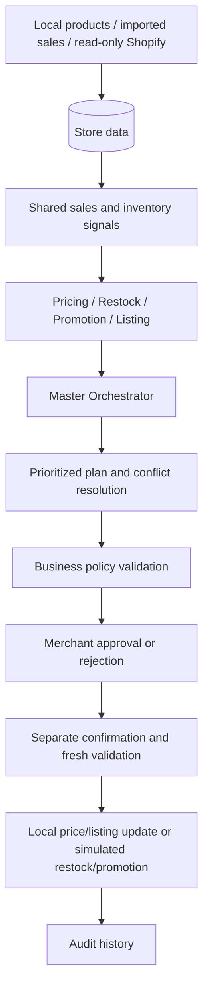

# CartPilot

**An e-commerce manager that turns inventory and sales data into explainable actions.**

CartPilot helps a merchant answer four questions: **What price should I review? What
should I restock? Which products could benefit from a promotion? Which listings need
improvement?** It combines these answers into a prioritized plan, checks business
rules, and keeps the merchant in control through approval and audit history.

Built with **React + TypeScript, FastAPI + Python, and SQLAlchemy**, with PostgreSQL
as the deployment database and SQLite for isolated tests and demos.

> The current agents use deterministic business rules. No external LLM, trained
> forecasting model or autonomous learning is implemented. “Multi-agent” describes
> four specialist modules coordinated by a master orchestrator.

## Understand the project in one minute

A merchant usually reviews sales, stock, pricing and product descriptions separately.
Those decisions can conflict: a discount may increase demand for a product that is
already close to running out.

CartPilot reads the same store data for each specialist, combines their recommendations,
and resolves conflicts before showing a plan. For example, when stock is low and
sales are strong, replenishment can take priority and a promotion can be blocked.
Recommendations explain their reason, risk and heuristic confidence.

**The main engineering idea is coordination with safety:** a recommendation does not
change store data. Approval and execution are separate steps, and execution checks
the latest state again.

## What a merchant can do

| Feature | What it does |
| --- | --- |
| Accounts | Register, sign in and sign out; access the account's own store |
| Store management | Create, edit and archive local products; retain sales and price history |
| Sales & Insights | Import a bounded sales CSV, view recorded revenue and rank products |
| Stock notifications | View low-stock alerts computed from current inventory |
| Specialist analysis | Request pricing, restock, promotion and listing recommendations |
| AI Manager | Combine specialist results into a plan for a selected merchant goal |
| Review workflow | Review policies, approve/reject, then separately confirm eligible execution |
| History | Inspect saved recommendations, price changes and action audit records |
| Shopify integration | Read-only synchronization in development/test; offline tests use mocked responses |

Revenue means **recorded sales totals**; the project does not demonstrate a measured
increase in business revenue. Stock alerts are shown in the application, not delivered
by an email service.

## How the agents work

| Module | Inputs | Decision | Safety check |
| --- | --- | --- | --- |
| Pricing | Price, cost, sales history and stock | Hold, increase or decrease recommendation | Bounded movement and cost protection |
| Restock | Available stock, demand and lead time | Suggested replenishment quantity and stockout exposure | Valid inventory and capped quantity |
| Promotion | Stock coverage, sales trend, price and cost | Margin-safe discount candidate | Block unsafe discounts and stockout conflicts |
| Listing | Title, description, category and SKU | Factual content improvements and completeness checks | Preserve facts; request verification for missing attributes |
| Master Orchestrator | Merchant goal and shared store signals | Prioritized plan with conflicts, dependencies and synergies | Merchant scope, inventory overrides and partial-failure visibility |

Exact rules and rounding are documented in [Algorithms](docs/ALGORITHMS.md). Confidence
scores express rule-based evidence strength; they are not calibrated prediction accuracy.

## Architecture



The React interface calls typed FastAPI endpoints. Pydantic validates API data,
SQLAlchemy handles persistence, and Alembic manages database migrations. Account
sessions bind authenticated requests to a merchant's store.

| Layer | Technology and purpose |
| --- | --- |
| Frontend | React 18, TypeScript, Vite, Tailwind CSS; merchant interface and typed API client |
| Backend | Python 3.12+, FastAPI, Pydantic; APIs and business rules |
| Persistence | Async SQLAlchemy, PostgreSQL, Alembic; records, transactions and migrations |
| Tests | pytest, pytest-asyncio, httpx, Vitest and React Testing Library |
| CI | GitHub Actions; backend tests, frontend tests and production build |
| Optional infrastructure | Redis for diagnostics; recommendations do not depend on it |

Read [ARCHITECTURE.md](ARCHITECTURE.md) for transaction and deployment details.

## Explain it in a placement interview

### 30-second introduction

> “CartPilot is a full-stack e-commerce decision-support project. It analyzes sales
> and inventory through four specialist modules for pricing, restocking, promotions
> and product listings. A master orchestrator combines their recommendations and
> resolves conflicts. Merchants review and approve eligible actions, while the
> backend validates policies and records an audit trail. It uses React and TypeScript
> on the frontend, FastAPI on the backend, and SQLAlchemy for persistence.”

### Two-minute explanation

1. **Problem:** store decisions are connected, but merchants often review them separately.
2. **Solution:** specialist modules analyze shared data and an orchestrator creates one prioritized plan.
3. **Example:** low stock can override a promotion suggestion, preventing conflicting advice.
4. **Implementation:** typed APIs, account-scoped access, database migrations, transactional workflows and a React dashboard.
5. **Safety:** recommendations, approval and execution are separate; execution revalidates current values and prevents duplicate execution.
6. **Evidence:** the latest local review passed 583 backend tests, 89 frontend tests and the TypeScript/Vite build.
7. **Limits:** rules are deterministic; Shopify is read-only; restock and promotion execution are simulated.

### Questions you should be ready to answer

| Interview question | Key point to explain |
| --- | --- |
| Why multiple agents? | Each specialist has focused inputs and rules; coordination handles decisions that affect each other. |
| Is this an LLM project? | The current implementation uses deterministic rules, which make recommendations reproducible and testable. |
| How do you prevent unsafe changes? | Typed validation, policy limits, explicit approval, separate execution and fresh state checks. |
| How do you protect different stores? | Authenticated requests use server-bound merchant scope; ownership checks reject foreign-store access. |
| How does login work? | Salted scrypt password hashes and expiring, revocable sessions; stored session tokens are hashed. |
| What if an agent fails? | The plan exposes partial failures so incomplete analysis is visible. |
| What if an action is executed twice? | Workflow identity and atomic state checks support idempotency. |
| How did you test it? | Isolated SQLite fixtures, API tests, rule/failure tests, mocked Shopify and frontend interaction tests. |
| What would you improve next? | Public ingress rate controls, password recovery, provider/concurrency testing and measured forecasting. |

Describe **your own contribution accurately**: identify the modules you implemented,
one design decision you can defend, and a bug you fixed. The repository alone does
not establish who authored each part. See [VIVA_QA.md](VIVA_QA.md) for deeper questions;
its Phase 14 answers should be read alongside the current account/store continuation.

## A simple interview demo

1. Open the dashboard and explain inventory, sales and recommendations.
2. Show Manage Store, Sales & Insights and Notifications. A new account starts empty: add a product and import sales first.
3. Use seeded demo data to show richer specialist recommendations and a Balanced Growth plan.
4. Explain one recommendation and one conflict or blocked action.
5. In a private development/test demo, approve an eligible action and separately confirm execution.
6. Show the resulting local change or simulation and the audit history.

Seeded demo merchants are separate from newly registered accounts. For the repeatable
four-product scenario and offline Shopify fixture, use [DEMO_SCRIPT.md](DEMO_SCRIPT.md).
Production blocks guarded action writes and Shopify routes even after login.

## Project structure

```text
backend/
  app/agents/        Specialist interfaces
  app/services/      Signals, rules, orchestration, account and action workflows
  app/api/v1/        Auth, store, management, analysis and action endpoints
  app/models/        Database models
  app/schemas/       Typed request and response contracts
  alembic/           Database migrations
  tests/             Regression, API, failure and offline scenario tests
frontend/
  src/components/    Shared UI and merchant workflow components
  src/pages/         Dashboard, catalog, analysis, approval and history pages
  src/services/      Typed backend client
  tests/             UI and API-client tests
docs/                Algorithms, testing guides and supporting evidence
phases/              Historical implementation records
.github/workflows/   Automated tests and build checks
```

## Quick local launch (Mac)

Double-click `Start CartPilot.command`, or run:

```bash
cd /Users/priyanshuraj/Projects/cartpilot
bash scripts/dev.sh
```

This starts both services, opens the browser, and enables pooled database connections
for local development. Keep the Terminal window open. It uses your configured database;
it does not migrate, seed, or replace existing data. Account/store management still
requires sign-in. Production configuration is unchanged. If a service is already
running, the launcher reuses it. Set `VITE_API_URL=http://localhost:8000` in the root
`.env` for the local frontend. A URL belongs in the browser address bar; Terminal can
open it with `open http://127.0.0.1:5173/dashboard`.

Catalog sales/history are aggregated in two batch queries per page instead of three
queries per product. Refresh keeps existing same-merchant data visible until the
new snapshot arrives; changing merchants clears it immediately.

## Local setup

From repository root:

```bash
cp .env.example .env
# Edit local environment values as needed; never commit this file.
docker compose up -d postgres redis
```

Settings load repository-root `.env`, then optional `backend/.env`; process environment
variables have highest precedence. Frontend credentials must never contain Shopify
access tokens. Set VITE_API_URL to the backend URL and VITE_CURRENCY to your display
currency (USD by default). Display currency does not convert stored prices.

In a backend terminal:

```bash
cd backend
python3.12 -m venv venv
source venv/bin/activate
pip install -r requirements.txt -c requirements.lock.txt
alembic upgrade head
python -m app.core.seed
uvicorn app.main:app --host 127.0.0.1 --port 8000 --reload
```

Apply migrations before seeding. The seed is development data: 1 merchant, 25 products,
25 inventory records, 110 orders and 25 price-history records. It skips reseeding when
merchants already exist. Never seed a valuable production database.

In a frontend terminal, from repository root:

```bash
cd frontend
npm ci
npm run dev -- --host 127.0.0.1
```

Open `http://localhost:5173/dashboard`; backend OpenAPI is at
`http://localhost:8000/docs`. API versioned routes begin `/api/v1`.

If Docker is unavailable, an isolated local SQLite demo can be used with an absolute
path to a new disposable file. Before backend migration/seed/server commands, export:

```bash
export ENVIRONMENT=development
export DATABASE_URL=sqlite+aiosqlite:////absolute/path/to/disposable-demo.sqlite
```

The standard seed supports varied demand and stock. For a repeatable four-product
scenario, follow [DEMO_SCRIPT.md](DEMO_SCRIPT.md).
Root `.env` may contain other settings; process values override it. Phase 13 verified
fresh PostgreSQL migrations and basic execution; provider TLS and concurrency stress
remain deployment checks.

## Use the account workflow locally

In the root `.env`, set `REQUIRE_AUTH=true` and `VITE_REQUIRE_AUTH=true`, then restart
the backend and restart/rebuild the frontend. Production always requires accounts.
Register a new account, add products and import sales to populate your own store.
Signing up does not claim an existing seeded merchant.

Sales CSV headers: `reference,product_id,quantity,unit_price,ordered_at`. Use past
timezone-aware timestamps, up to 500 rows and one product per reference. Reimporting
the same reference and values skips the duplicate. Sales import does not reduce
physical inventory. See [Account and store management](docs/ACCOUNT_STORE_MANAGEMENT.md).

## Test and build

From the repository root:

```bash
cd backend
venv/bin/python -m pytest -q
cd ../frontend
npm run test:run
npm run build
```

**Latest local verification, 4 October 2026:** 583 backend tests, 89 frontend tests
across 12 files, and a successful TypeScript/Vite production build. Tests use isolated
SQLite and mocked external services. These results do not certify live Shopify,
production load capacity or the complete hosted user journey. The prepared 18-case
manual acceptance sheet remains unexecuted.

See [Current testing review](docs/testing/CURRENT_TEST_REVIEW.md),
[Testing procedure](docs/testing/STEP_BY_STEP_TESTING.md) and
[Manual test sheet](docs/testing/MANUAL_TEST_CASES.csv). GitHub Actions is configured
to run tests/build on pushes and pull requests; local results are separate from CI results.

## Current boundaries and next steps

- Local price/listing execution is guarded; restock and promotion execution are simulations.
- Shopify synchronization is read-only and development/test only. No Shopify write or real supplier/campaign operation is implemented.
- Password recovery, email verification, delivered email alerts and ingress rate controls remain future work.
- Public launch requires broader security, provider, concurrency and load verification.
- No cart recovery, trained demand forecasting, currency conversion or autonomous learning is implemented.

## Further reading

| Document | Use it for |
| --- | --- |
| [Architecture](ARCHITECTURE.md) | System boundaries, consistency and security design |
| [Algorithms](docs/ALGORITHMS.md) | Exact specialist formulas and guardrails |
| [API/database/security](docs/API_DATABASE_SECURITY.md) | Core API and data reference; pair with the account continuation |
| [Account and store management](docs/ACCOUNT_STORE_MANAGEMENT.md) | Current authentication and merchant workflows |
| [Demo script](DEMO_SCRIPT.md) | Repeatable academic/interview demonstration |
| [Viva questions](VIVA_QA.md) | Detailed technical preparation |
| [Project report outline](PROJECT_REPORT_OUTLINE.md) | Report and presentation structure |
| [Deployment guide](DEPLOYMENT.md) | Backend startup, migrations, HTTPS and hosting configuration |
| [Vercel + Neon setup](docs/VERCEL_NEON.md) | Provider-specific setup notes |
| [Report and slides](docs/deliverables/README.md) | Historical academic artifacts with identity placeholders |

Earlier phase documents and academic artifacts record earlier versions. Use the
current testing review and account/store guide when discussing the present project.
